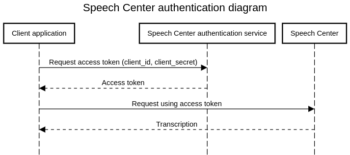

# Python integration with the Verbio Speech Center cloud.

This repository contains a python example of how to use the Verbio Technologies Speech Center cloud both for speech recognition and speech synthesis, allowing users to test the streaming capabilities of Speech Center. 

## Index

1. Pre-Requirements
2. Set-up
3. Speech recognition
4. Speech Synthesis
5. Customer Credentials
6. Dashboard


## Pre-Requirements
Before starting you will need:

1. Dashboard user account (provided to you by Verbio Technologies), please contact our sales team at info@verbio.com to get one.
2. Speech center streaming endpoint valid for speech recognition and speech synthesis. Please check the endpoints section.
3. Speech Center proto files (provided under proto directory in this repository).
4. Python 3.6+
5. Protobuf package 3.20.x or lower (or set PROTOCOL_BUFFERS_PYTHON_IMPLEMENTATION=python but this will use pure-Python parsing and will be much slower).
6. Pip

## Endpoints

Speech Center streaming endpoint for STT (Speech-To-Text) and TTS (Text-To-Speech):  **us.speechcenter.verbio.com**

##  Set-up
The steps needed are very similar to the ones described in the grpc official guide.

### Install dependencies
You can use the standard pip call to install all the necessary dependencies, from the root of the repo run:
```shell
pip install -r requirements.txt
```

### Generate grpc code with python
In scripts directory there is a `generate_grpc_code.sh` script that will generate the gRPC and Protobuf code for you.
```shell
cd scripts/
./generate_grpc_code.sh
```

The script must be called from inside the `scripts` directory. It will generate all needed grpc files on the project root directory `proto/generated` like:

```text
verbio_speech_center_recognizer_pb2.py
verbio_speech_center_recognizer_pb2_grpc.py
...
```

### Run a client

The CLI clients will use the generated code to connect to the speech center cloud to process your speech file. To run the clients, run either the `recognizer_stream.py` for CSR requests, or the `synthesizer.py` for TTS requests, from the `cli-client` directory. Check the speech recognition or speech synthesis sections of this readme for more information.


## Speech-To-Text

Speech Center allows to easily convert an audio resource into its associated text. Access the `cli-client` directory to run `recognizer_stream.py` located inside to test Speech Center's speech recognition (CSR) capabilities. Before proceeding, the client needs either a valid token for Speech Center or the user's client credentials. Please check the **Customer Credentials** section of this README before proceeding if you haven't got either.

Speech recognition CLI will retrieve an audio file stored locally and send it through streaming to Speech Center's GRPC interface. To run the client please run the `recognizer_stream.py` from the `cli-client` directory. An example transcription request is shown below, all the flags are then detailed.


**Example for streaming**

```shell
cd cli-client/
python3 recognizer_stream.py --audio-file file.wav --topic GENERIC --language en-US --host us.speechcenter.verbio.com --token token.file --asr-version V1 --label project1
```

You can use the `--help`command for more options.

This code will generate the following terminal output on success:
```text
[2023-04-04 12:28:29,078][INFO]:Running speechcenter streaming channel...
[2023-04-04 12:28:29,080][INFO]:Connecting to us.speechcenter.verbio.com
[2023-04-04 12:28:29,082][INFO]:Running executor...
[2023-04-04 12:28:29,083][INFO]:Sending streaming message config
[2023-04-04 12:28:29,083][INFO]:Running response watcher
[2023-04-04 12:28:29,083][INFO]:Waiting for server to respond...
[2023-04-04 12:28:29,084][INFO]:Sending streaming message audio
[2023-04-04 12:28:29,084][INFO]:All audio messages sent
[2023-04-04 12:31:27,109][INFO]:New incoming response: '{  "result": {    "alternatives": [      {     ...'
	"transcript": "Hi. My name is John Doe.",
	"confidence": "0.899752",
	"duration": "4.460000"
[2023-04-04 12:31:27,110][INFO]:New incoming response: '{  "result": {    "alternatives": [      {     ...'
	"transcript": "I'd like to check my account balance, please.",
	"confidence": "0.994662",
	"duration": "7.000000"
[2023-04-04 12:31:32,111][INFO]:Stream inactivity detected, closing stream...
[2023-04-04 12:31:32,112][INFO]:Recognition finished


```

You can also run:
```shell
python3 recognizer_stream.py --help
```  
to list all the available options.

### Client flags for Speech-To-Text (STT)


#### Audio file

Argument: 
```
-a, --audio file
```

This argument is required, stating a path to a .wav audio in 8kHz or 16kHz sampling rate and PCM16 encoding to use for the recognition.

#### Topic

```
-T, --topic arg
```

 Topic to use for the recognition when a grammar is not provided. Must be `GENERIC` | `BANKING` | `TELCO` | `INSURANCE` (default: `GENERIC`).
 
> **THIS FEATURE IS STILL IN DEVELOPMENT, PLEASE USE THE GENERIC TOPIC FOR ALL REQUESTS OR AN ERROR WILL BE GIVEN.**

#### Language

```
-l, --language arg
```

Language to use for the recognition: `en-US`, `en-GB`, `pt-BR`, `es`, `es-419`, `tr`, `ja`, `fr`, `fr-CA`, `de`, `it` (default: `en-US`). Please check the [Speech Center streaming Soeech-To-Text documentation](https://speechcenter.verbio.com/documentation/index.php/speech-to-text-streaming/) for an updated list of language codes.

#### Diarization

```
-d, --diarization
```

This option enables diarization.

> This option is oriented towards batch transcription only and its use for streaming and call automation is not recommended.


#### Formatting

```
-f, --formatting
```

This option will enable formatting on the speech transcription. Please check the [Speech Center streaming Speech-To-Text documentation](https://speechcenter.verbio.com/documentation/index.php/speech-to-text-streaming/) for an updated list of languages that accept formatting.

#### Speech-To-Text engine version

```
-A, --asr-version arg
```

This will select the Speech-To-Text engine version the speech center will use for transcriptions.

> Please follow Verbio's sales department recommendation on which version to use.

#### Sample rate


```
-s, --sample-rate arg
```

Sampling rate for the audio generation: 8000 or 16000.

#### Token


```
-t, --token arg 
```

Path to the authentication token file. This file needs to have a valid token in order for the Speech Center to work. 

In order for the client to work, the token argument is required in the following situations:

- The client will authenticate just by using the available token file. The file provided in this argument **needs to be a valid SpeechCenter JWT token so the transcription service can work**.
- The client will authenticate by providing their client credentials through the `--client_id` and `--client_secret` program arguments. In this case **a token file must also be supplied even if it is a blank file**. Client will check file to see if it is a valid token, if it isn't it will refresh automatically the token and fill the file with a valid token. In this case, client_id and client_secret fields are also required.


#### Client id and secret


```
--client-id arg      Client id for token refresh (default: "")
```    

``` 
--client-secret arg  Client secret for token refresh (default: "")
``` 

`client-id` and `client-secret` fields are required for automatic token refreshal. The arguments need to be written inline with no quotes for each field. Please see the '**Automatically Refresh Service Token**' section above for specific details.

#### Host


```
-H, --host arg
```

URL of the host where the request will be sent. Main endpoints will be expanded as the product is deployed in different regions. Please use **us.speechcenter.verbio.com** as the host for CSR requests.

#### Labels

```
-L, --label arg
```

This option allows for a one word argument to be sent so that the speech transcription request is billed as part of a particular project for the customer. The argument will be a one word name that will classify the request under that project.

- **Project name must only consist of one word.**
- **Argument must be the same each time for the same project. If there is a typo another project will be created.**
- **There is no limit on the amount of projects that can be created.**


## Text-To-Speech

Verbio's Speech Center allows to synthesize text in a whole catalogue of voices. Access the `cli-client` directory to run `synthesizer.py` located inside to test Speech Center's Text-To-Speech (TTS) capabilities. Before proceeding, the client needs either a valid token for Speech Center or the user's client credentials. Please check the **Customer Credentials** section of this README before proceeding if you haven't got either.

**Example for text to speech**
Synthesize request using valid token:
```
python3 synthesizer.py --text "Hello, my friend!" --voice tommy_en_us --audio-file out.wav --host your_speechcenter_hostname --token ./my.token
```
Using client credentials for automated token refreshal:
```
python synthesizer.py --text "Hello my friend!" --voice tommy_en_us --audio-file out.waw --host your_speechcenter_ hostname --client-id your_client_id --client-secret your_client_secret --token token.file
```

Please check out documentation at speechcenter.verbio.com/documentation for current TTS capabilities.

### Text-To-Speech Client flags

#### Help

Argument: 
```
-h, --help
```
Help menu detailing the client's options and a list of all available voices.

#### Text

```
-T, --text "My text string"
```

String of text to convert into speech.


#### Voice

```
-v, --voice arg
```

Voice to use for the text to speech generation. Please bear in mind that each voice has also the language code encoded in it. Some of the available voices are `tommy_en_us` (US English),`miguel_es_pe` (Peruvian Spanish),`bel_pt_br` (Brazilian Portuguese),`david_es_es` (Castillian Spanish),`anna_ca` (Catalan). Please check the [Speech Center documentation](https://speechcenter.verbio.com/documentation) for an updated list of voices.


#### Sample rate


```
-s, --sample-rate arg
```

Sampling rate for the audio generation: 16000 (default: 16000).

#### Token


```
-t, --token arg 
```

Path to the authentication token file. This file needs to have a valid token in order for the Speech Center to work. 

In order for the client to work, the token argument is required in the following situations:

- The client will authenticate just by using the available token file. The file provided in this argument **needs to be a valid SpeechCenter JWT token so the transcription service can work**.
- The client will authenticate by providinf their client credentials through the `--client_id` and `--client_secret` program arguments. In this case **a token file must also be supplied even if it is a blank file**. Client will check file to see if it is a valid token, if it isn't it will refresh automatically the token and fill the file with a valid token. In this case, client_id and client_secret fields are also required.


#### Client id and secret


```
--client-id arg      Client id for token refresh (default: "")
```    

``` 
--client-secret arg  Client secret for token refresh (default: "")
``` 

`client-id` and `client-secret` fields are required for automatic token refreshal. The arguments need to be written inline with no quotes for each field. Please see the '**Automatically Refresh Service Token**' section above for specific details.

#### Host


```
-H, --host arg
```

URL of the host where the request will be sent. Main endpoints will be expanded as the product is deployed in different regions. Please use **us.speechcenter.verbio.com** as the host for CSR requests.


## Customer Credentials

All speech requests sent to Speech Center must have a valid authorization token in order for the system to successfully process the request. These tokens have a validity period of 1 hour and can be generated on demand using your customer credentials.

Your customer credentials can be retrieved through the [Speech Center Dashboard](https://dashboard.speechcenter.verbio.com) by logging in with the customer account supplied to you by Verbio.

### Authentication flow


To acquire a valid token submit an HTTP POST request to the authentication service at `https://auth.speechcenter.verbio.com:444`.

**Token expiration management**



As part of the JWT specification, we fully support the token expiration claim, so generated tokens will be valid for only a finite period of time of 1 hour to up to 1 day. It is the responsibility of the calling client to manage this token expiration time and, in a best case scenario, anticipate the refresh by a couple of minutes so the streaming session attempt never fails because of token expiration.

In order to refresh the token, the token refresh endpoint can be called with the same client_id and client_secret, and it will respond with a new JWT token with a renewed expiration time.


### Authentication API

**Method**
POST

**Resource**
```
/api/v1/token
```
**Request body**

```
{
 "client_id":"your_client_id",
 "client_secret":"your_client_secret"
}
```

**Response body**

Content type: application/json
Body:
```
{
 "access_token": "new_access_token",
 "expiration_time": 1678453328
}
```
*expiration_time field contains the expiration time for the JWT token so there is no need to decode the token on the client request to know the token expiration time.

Status codes:
```
HTTP 200: OK
HTTP 400: KO - Provided request format was invalid.
HTTP 401: KO - There was a problem with the provided credentials.
HTTP 5XX: KO - There was a problem with the server.
```

### Testing calls using curl

**Example request**
```
curl --header "Content-Type: application/json"   --request POST   --data '{"client_id":"YOUR_CLIENT_ID","client_secret":"YOUR_CLIENT_SECRET"}'   'https://auth.speechcenter.verbio.com:444/api/v1/token'
```

**Example response**

{
  "access_token": "EXAMPLE_ACCESS_TOKEN",
  "expiration_time": 1678453328
}

### Automatically Refresh Service Token

This repository optionally implements an automatic token update. To use it, you must specify your credentials (find them in the Client Credentials section of the [user dashboard](https://dashboard.speechcenter.verbio.com)).

You must also specify a token file, where the token will be stored and updated in case it is invalid or expired.

**Example**
```shell
python3 recognizer_stream.py --client-id="your-client-id" --client-secret="your-client-secret"
 --audio-file file.wav --topic GENERIC --language en-US --host us.speechcenter.verbio.com --token token.file --asr-version V1 --label project1

```

**WARNING**

Please note that due to a limitation of the command line argument parser, the `client_id` and `client_secret` arguments MUST be written in the following format since they might contain hyphens.

```text
--client-id="your-client-id"
           ^
```
> Note the usage of the `=` sign

Not defining the arguments like this will yield an error.

## Dashboard 

Speech Center features a dashboard at https://dashboard.speechcenter.verbio.com. 
Dashboard serves two main purposes:

1. Allow users to follow up historical usage data of the service, separated by projects or as a whole.
2. Allow users to retrieve client_id and client_secret credentials necessary to integrate with Speech Center, please look at authentication section to learn more about how this is performed. 
